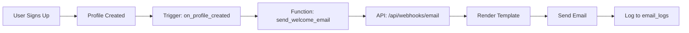
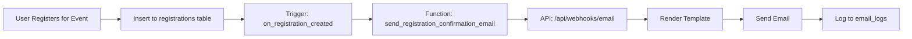

# Email Notification System - Complete Guide

## 🚨 Quick Fix for "Registration error: {}"

**Issue:** Seeing empty error object `{}` in console during registration?  
**Good News:** Registration still works! Email just isn't configured yet.

**Quick Fix (2 minutes):**

1. **Get Service Role Key** from Supabase Dashboard:
   - Go to: Project Settings → API → Project API Keys
   - Copy `service_role` key (secret!)

2. **Add to `.env.local`:**
   ```env
   SUPABASE_SERVICE_ROLE_KEY=your_service_role_key_here
   NEXT_PUBLIC_APP_URL=http://localhost:3000
   ```

3. **Run Database Migration:**
   - Open Supabase Dashboard → SQL Editor
   - Copy ALL content from: `supabase/migrations/create_email_system.sql`
   - Paste and click "Run"

4. **Restart Dev Server:**
   ```bash
   npm run dev
   ```

✅ Done! Emails will now log properly (actual sending needs email provider setup - see below)

---

## Overview
Sistem notifikasi email otomatis untuk NGEvent menggunakan Supabase dengan email triggers dan custom email templates.

## Features
✅ Welcome email untuk user baru  
✅ Confirmation email saat registrasi event  
✅ Customizable email templates  
✅ Email logging untuk tracking  
✅ Auto-trigger menggunakan PostgreSQL functions  

## Architecture

### 1. Database Components

#### Tables
- **email_templates**: Menyimpan template email HTML/Text
- **email_logs**: Tracking semua email yang terkirim
- **Existing tables**: profiles, events, registrations

#### Functions
- `send_welcome_email()`: Trigger saat profile baru dibuat
- `send_registration_confirmation_email()`: Trigger saat registrasi event

#### Triggers
- `on_profile_created_send_welcome_email`: Auto-send welcome email
- `on_registration_created_send_email`: Auto-send confirmation email

### 2. API Components

#### Email Webhook API
- **Endpoint**: `/api/webhooks/email`
- **Method**: POST
- **Purpose**: Process email requests dan render templates

#### Email Helper Library
- **File**: `lib/email.ts`
- **Functions**:
  - `sendWelcomeEmail()`
  - `sendRegistrationEmail()`
  - `formatEventDateForEmail()`

## Setup Instructions

### Step 1: Run Database Migration

```bash
# Run migration di Supabase SQL Editor
# Copy contents dari: supabase/migrations/create_email_system.sql
```

atau via Supabase CLI:

```bash
supabase migration new create_email_system
# Copy SQL content ke file
supabase db push
```

### Step 2: Configure Environment Variables

Tambahkan ke `.env.local`:

```env
# Supabase Service Role Key (untuk admin operations)
SUPABASE_SERVICE_ROLE_KEY=your_service_role_key_here

# App Base URL (untuk links di email)
NEXT_PUBLIC_APP_URL=https://your-domain.com

# Optional: Email Service API Keys
# RESEND_API_KEY=your_resend_api_key
# SENDGRID_API_KEY=your_sendgrid_api_key
```

### Step 3: Enable pg_net Extension (Optional)

Jika ingin menggunakan database triggers untuk webhook calls:

```sql
-- Di Supabase SQL Editor
CREATE EXTENSION IF NOT EXISTS pg_net;

-- Set webhook URL
ALTER DATABASE postgres SET app.settings.webhook_url = 'https://your-domain.com/api/webhooks/email';
ALTER DATABASE postgres SET app.settings.service_role_key = 'your_service_role_key';
```

### Step 4: Verify Installation

```sql
-- Check tables
SELECT * FROM email_templates;
SELECT * FROM email_logs LIMIT 10;

-- Check functions
\df send_welcome_email
\df send_registration_confirmation_email

-- Check triggers
SELECT trigger_name, event_manipulation, event_object_table 
FROM information_schema.triggers 
WHERE trigger_name LIKE '%email%';
```

## Email Flow

### Welcome Email Flow



**Trigger Points:**
1. User login dengan Google OAuth (first time)
2. Profile otomatis dibuat via `handle_new_user()` trigger
3. Welcome email trigger fires
4. Email sent via webhook API

### Registration Confirmation Flow



**Trigger Points:**
1. User fills registration form
2. Data inserted to `registrations` table
3. Trigger automatically fires
4. Email sent with event details

## Email Templates

### Welcome Email

**Variables:**
- `{{user_name}}`: User's full name
- `{{base_url}}`: Application base URL

**Template:**
```html
<h1>Welcome to NGEvent!</h1>
<p>Hi {{user_name}},</p>
<p>Thank you for joining NGEvent!</p>
<a href="{{base_url}}/events">Browse Events</a>
```

### Registration Confirmation Email

**Variables:**
- `{{user_name}}`: User's full name
- `{{event_title}}`: Event title
- `{{event_date}}`: Formatted event date
- `{{event_location}}`: Event location
- `{{organizer_name}}`: Organizer's name
- `{{event_id}}`: Event ID for link
- `{{base_url}}`: Application base URL

**Template:**
```html
<h1>Registration Confirmed!</h1>
<p>Hi {{user_name}},</p>
<p>Your registration for <strong>{{event_title}}</strong> has been confirmed!</p>
<p>📅 Date: {{event_date}}</p>
<p>📍 Location: {{event_location}}</p>
<a href="{{base_url}}/events/{{event_id}}">View Event Details</a>
```

## Email Template Management

### Viewing Templates

```sql
SELECT * FROM email_templates WHERE active = true;
```

### Updating Templates

```sql
UPDATE email_templates
SET html_body = '<html>... new template ...</html>',
    subject = 'New Subject {{event_title}}',
    updated_at = NOW()
WHERE template_type = 'registration_confirmation';
```

### Adding New Template Type

```sql
INSERT INTO email_templates (template_type, subject, html_body, text_body, variables)
VALUES (
    'event_reminder',
    'Reminder: {{event_title}} starts tomorrow',
    '<html>...</html>',
    'Text version...',
    '{"event_title": "Event title", "event_date": "Event date"}'
);
```

## Manual Email Sending

### From Client-Side

```typescript
import { sendWelcomeEmail, sendRegistrationEmail } from '@/lib/email';

// Send welcome email
await sendWelcomeEmail({
    userId: user.id,
    email: user.email,
    name: user.full_name
});

// Send registration email
await sendRegistrationEmail({
    userId: user.id,
    email: user.email,
    userName: user.full_name,
    eventId: event.id,
    eventTitle: event.title,
    eventDate: formatEventDateForEmail(event.start_date),
    eventLocation: event.location,
    organizerName: organizer.full_name,
    registrationId: registration.id
});
```

### From API Route

```typescript
const response = await fetch('/api/webhooks/email', {
    method: 'POST',
    headers: { 'Content-Type': 'application/json' },
    body: JSON.stringify({
        type: 'welcome_email',
        user_id: userId,
        email: userEmail,
        name: userName
    })
});
```

## Email Service Integration

### Option 1: Resend (Recommended)

```bash
npm install resend
```

Update `/api/webhooks/email/route.ts`:

```typescript
import { Resend } from 'resend';

const resend = new Resend(process.env.RESEND_API_KEY);

// In the POST handler:
await resend.emails.send({
    from: 'NGEvent <noreply@yourdomain.com>',
    to: payload.email,
    subject: subject,
    html: htmlBody,
    text: textBody
});
```

### Option 2: SendGrid

```bash
npm install @sendgrid/mail
```

```typescript
import sgMail from '@sendgrid/mail';

sgMail.setApiKey(process.env.SENDGRID_API_KEY!);

await sgMail.send({
    from: 'noreply@yourdomain.com',
    to: payload.email,
    subject: subject,
    html: htmlBody,
    text: textBody
});
```

### Option 3: Supabase SMTP (Built-in)

Configure di Supabase Dashboard:
1. Settings → Auth → Email Templates
2. Configure SMTP settings
3. Emails akan otomatis terkirim via Supabase

## Monitoring & Debugging

### View Email Logs

```sql
-- Recent emails
SELECT * FROM email_logs 
ORDER BY created_at DESC 
LIMIT 20;

-- Failed emails
SELECT * FROM email_logs 
WHERE status = 'failed' 
ORDER BY created_at DESC;

-- Emails for specific user
SELECT * FROM email_logs 
WHERE user_id = 'user-uuid-here'
ORDER BY created_at DESC;

-- Email stats
SELECT 
    email_type, 
    status, 
    COUNT(*) as count
FROM email_logs
GROUP BY email_type, status;
```

### Check User's Email History

Via API:
```typescript
import { getEmailLogs } from '@/lib/email';

const { data: logs } = await getEmailLogs(userId);
console.log('Email history:', logs);
```

### Debug Triggers

```sql
-- Check if triggers are enabled
SELECT * FROM pg_trigger 
WHERE tgname LIKE '%email%';

-- Manually test welcome email function
SELECT send_welcome_email_test('user-id-here');

-- Manually test registration email
SELECT send_registration_confirmation_email_test('registration-id-here');
```

## Testing

### Test Welcome Email

```typescript
// 1. Create new user via Google OAuth
// 2. Check email_logs table
SELECT * FROM email_logs WHERE email_type = 'welcome_email' ORDER BY created_at DESC LIMIT 1;
```

### Test Registration Email

```typescript
// 1. Register for an event
// 2. Check email_logs table
SELECT * FROM email_logs WHERE email_type = 'registration_confirmation' ORDER BY created_at DESC LIMIT 1;
```

### Test Email Template Rendering

```sql
SELECT 
    template_type,
    REPLACE(subject, '{{event_title}}', 'Test Event') as rendered_subject
FROM email_templates;
```

## Troubleshooting

### Common Error: "Registration error: {}"

**Cause:** Email system not fully configured yet (this is normal!)

**What happens:**
- Registration STILL WORKS ✅
- Event is registered successfully ✅
- Email just doesn't send (gracefully fails) ⚠️
- Empty error logged but doesn't break functionality

**Why this happens:**
1. `SUPABASE_SERVICE_ROLE_KEY` not set in `.env.local`
2. Database migration `create_email_system.sql` not run yet
3. Email templates table doesn't exist yet

**Solution:**
```bash
# Step 1: Add service role key to .env.local
SUPABASE_SERVICE_ROLE_KEY=your_service_role_key_here

# Step 2: Run database migration
# Go to Supabase Dashboard → SQL Editor
# Copy and paste contents from: supabase/migrations/create_email_system.sql
# Run the SQL

# Step 3: Restart dev server
npm run dev
```

**Temporary workaround:**
System is designed to fail gracefully - registrations will continue to work even without email system configured!

### Email Not Sent

**Check:**
1. Trigger ada dan enabled: `SELECT * FROM pg_trigger WHERE tgname LIKE '%email%';`
2. Function tidak error: Check PostgreSQL logs
3. Webhook URL correct di settings
4. Service role key valid
5. Email logs untuk error message: `SELECT * FROM email_logs WHERE status = 'failed'`

### Template Not Found

```sql
-- Verify template exists
SELECT * FROM email_templates WHERE template_type = 'welcome';

-- Check if active
SELECT * FROM email_templates WHERE template_type = 'welcome' AND active = true;
```

### Variables Not Replaced

**Check:**
- Variable names match exactly (case-sensitive)
- Variables wrapped with `{{variable_name}}`
- Template uses correct variable names

### Email Service Not Configured

Currently configured as "log only" mode. To actually send emails:
1. Choose email service (Resend/SendGrid/SMTP)
2. Get API key
3. Update `/api/webhooks/email/route.ts`
4. Uncomment email sending code

## Security

### RLS Policies

```sql
-- Users can only view their own email logs
CREATE POLICY "Users can view own email logs"
ON email_logs FOR SELECT
USING (auth.uid() = user_id);

-- Only service role can modify templates
CREATE POLICY "Service role can modify templates"
ON email_templates FOR ALL
USING (auth.role() = 'service_role');
```

### Service Role Key

⚠️ **NEVER** expose service role key in client-side code!
- Only use in server-side API routes
- Store in `.env.local` (not committed to git)
- Use different keys for dev/staging/prod

## Performance Optimization

### Email Queue (Future Enhancement)

For high-volume applications:
1. Use job queue (Bull/BullMQ)
2. Batch email sending
3. Rate limiting
4. Retry failed emails

### Template Caching

Templates are fetched from DB each time. For better performance:
```typescript
// Cache templates in memory
const templateCache = new Map();

function getCachedTemplate(type: string) {
    if (!templateCache.has(type)) {
        const template = await fetchTemplateFromDB(type);
        templateCache.set(type, template);
    }
    return templateCache.get(type);
}
```

## Future Enhancements

- [ ] Unsubscribe functionality
- [ ] Email preferences per user
- [ ] Rich email builder UI
- [ ] A/B testing for templates
- [ ] Email analytics (open rate, click rate)
- [ ] Scheduled emails
- [ ] Email attachments (certificates, tickets)
- [ ] Multi-language email templates

## Support

For issues or questions:
1. Check email_logs for error messages
2. Review PostgreSQL logs in Supabase
3. Test with manual API calls
4. Verify environment variables

## Quick Reference

| Action | Command/Code |
|--------|--------------|
| View logs | `SELECT * FROM email_logs ORDER BY created_at DESC LIMIT 10;` |
| Failed emails | `SELECT * FROM email_logs WHERE status = 'failed';` |
| Update template | `UPDATE email_templates SET html_body = '...' WHERE template_type = 'welcome';` |
| Send manual email | `await sendWelcomeEmail({ userId, email, name });` |
| Test template | `SELECT * FROM email_templates WHERE template_type = 'welcome';` |

## Status

✅ **READY TO USE** (dengan catatan: perlu configure email service)

**Current Mode:** Logging only (emails logged but not actually sent)

**To Go Live:**
1. Choose email provider (Resend recommended)
2. Get API key
3. Update `/api/webhooks/email/route.ts`
4. Uncomment email sending code
5. Test with real email address
6. Monitor email_logs table

---

Last Updated: November 7, 2025
